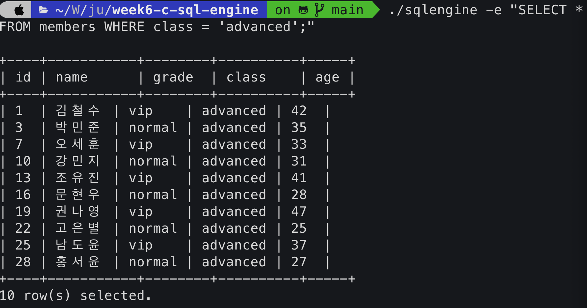
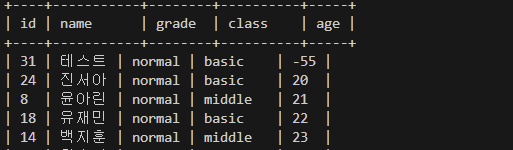
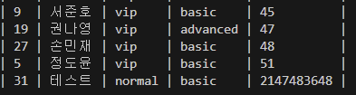
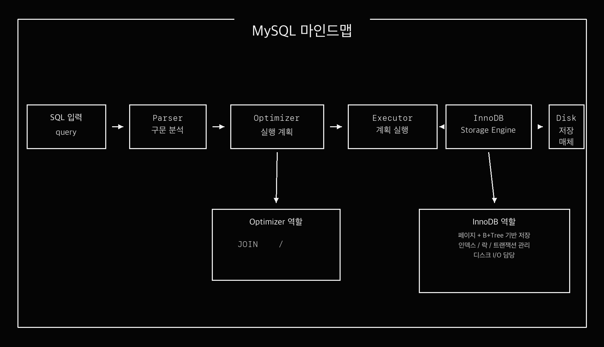
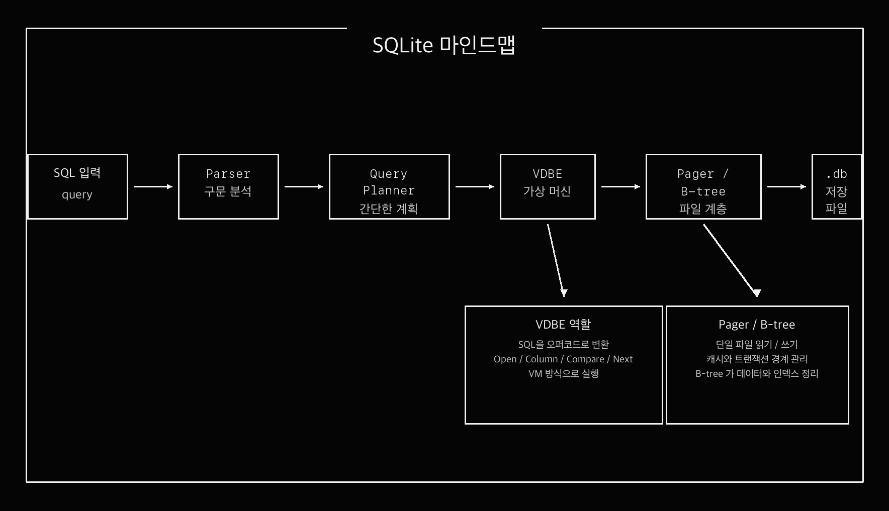
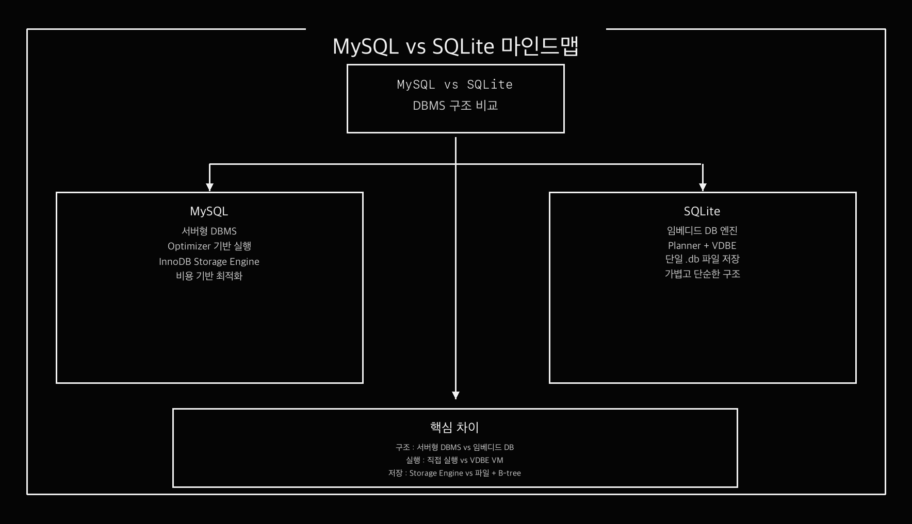
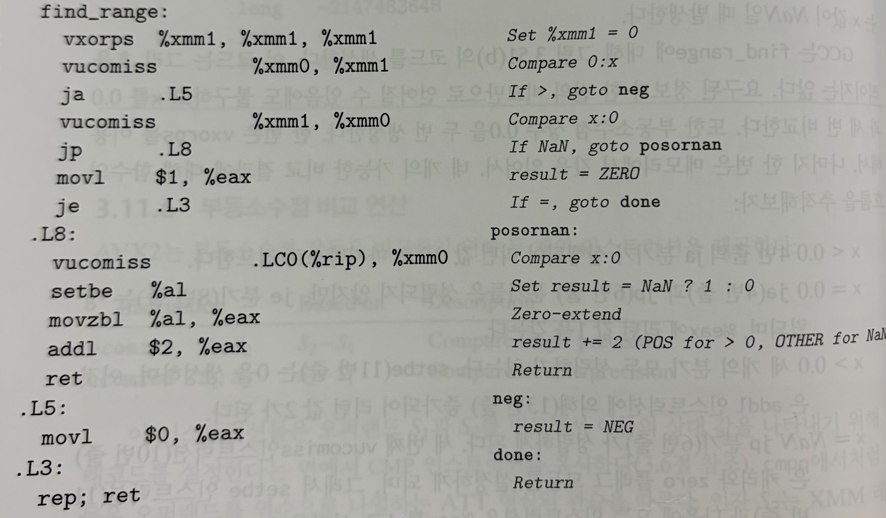

# C SQL Engine

파일 기반 저장소를 사용하는 최소 SQL 처리기.

C99로 구현 및, `INSERT` 와 `SELECT` 지원.



<br>

## Overview

프로젝트 흐름 동작

```text
SQL 입력
-> Lexer (토큰 분리)
-> Parser (문장 구조 해석)
-> Executor (실행)
-> Storage (파일 저장 / 파일 조회)
```

데이터는 `data/*.tbl` 파일에 저장, 스키마는 `schemas/*.schema` 파일에서 읽음.

<br>

### SQL 처리기 전체 파이프라인


<br>

### Lexer


<br>

### Parser


<br>

### Executor


<br>

## Supported SQL

현재 지원 범위

```sql
INSERT INTO members (id, name, grade, class, age) VALUES (1, 'Alice', 'vip', 'advanced', 30);

SELECT * FROM members;
SELECT id, name FROM members;
SELECT * FROM members WHERE age >= 20;
SELECT * FROM members WHERE grade = 'vip' AND age >= 25;
SELECT * FROM members WHERE class = 'advanced' OR class = 'basic';
SELECT * FROM members ORDER BY age;
SELECT name FROM members ORDER BY age DESC;
```
<br>

지원 연산자:

```text
=   !=   <>   <   >   <=   >=
```
<br>

주의:

- `CREATE TABLE`, `UPDATE`, `DELETE` 는 구현하지 않음.
- `WHERE` 절에서 `AND` 와 `OR` 를 한 문장 안에 섞는 것은 지원하지 않음.
- `ORDER BY` 는 단일 컬럼만 지원.
- `NULL` 은 `INSERT` 값으로만 지원.

<br>

## Project Structure

```text
src/
  main.c        CLI 진입점
  types.h       공통 타입
  lexer.c/h     SQL -> Token
  parser.c/h    Token -> Statement
  schema.c/h    schema 파일 로드
  storage.c/h   .tbl 파일 저장 / 조회
  executor.c/h  INSERT / SELECT 실행
  config.c/h    data, schema 경로 설정

schemas/
  members.schema

sql/
  members_demo.sql

data/
  실행 시 .tbl 파일 생성

tests/
  test_*.c
```
<br>

## Build

```bash
cd /Users/kunwoopark/WS/jungle-12/week6-c-sql-engine
make
```
<br>
디버그 빌드:

```bash
make debug
```
<br>
테스트 실행:

```bash
make test
```
<br>
정리:

```bash
make clean
```

<br>

## Basic Usage

### 1. 데이터 초기화

기존 저장 데이터를 지우고 처음부터 다시 테스트하고 싶을 때:

```bash
rm -f data/members.tbl
```

이 명령은 `members` 의 데이터 파일만 삭제.  
스키마 파일은 그대로 남아 있으므로 `make` 를 다시 할 필요는 없음.

<br>

### 2. SQL 한 줄 직접 실행

한 명 추가:

```bash
./sqlengine -e "INSERT INTO members (id, name, grade, class, age) VALUES (1, '김철수', 'vip', 'advanced', 42);"
```
<br>
전체 조회:

```bash
./sqlengine -e "SELECT * FROM members;"
```
<br>
조건 조회:

```bash
./sqlengine -e "SELECT * FROM members WHERE grade = 'vip';"
./sqlengine -e "SELECT * FROM members WHERE age >= 30;"
./sqlengine -e "SELECT id, name FROM members WHERE class = 'advanced';"
./sqlengine -e "SELECT * FROM members ORDER BY age;"
./sqlengine -e "SELECT name FROM members ORDER BY age DESC;"
```

<br>

### 3. SQL 파일 실행

예시 SQL 파일 실행:

```bash
./sqlengine -f sql/members_demo.sql
```

직접 SQL 파일을 만들어서도 실행 가능.

```bash
cat > sql/test.sql <<'EOF'
INSERT INTO members (id, name, grade, class, age) VALUES (1, '김철수', 'vip', 'advanced', 42);
INSERT INTO members (id, name, grade, class, age) VALUES (2, '이영희', 'normal', 'middle', 27);
SELECT * FROM members;
EOF

./sqlengine -f sql/test.sql
```

`cat > sql/test.sql <<'EOF'` 는 SQL 실행 명령이 아니라, 여러 줄의 SQL 문장을 `.sql` 파일로 저장하는 셸 문.

<br>

## CLI Options

```bash
./sqlengine -e "SELECT * FROM members;"
./sqlengine -f sql/members_demo.sql
./sqlengine -d ./data -s ./schemas -f sql/members_demo.sql
./sqlengine --help
./sqlengine --version
```
<br>

옵션 설명:

- `-e <sql>`: SQL 문자열 직접 실행
- `-f <file>`: SQL 파일 실행
- `-d <dir>`: 데이터 디렉토리 지정
- `-s <dir>`: 스키마 디렉토리 지정
- `--help`: 도움말 출력
- `--version`: 버전 출력

<br>

## MEMBERS Schema

기본 테이블 : `members`

| column | type | description |
|---|---|---|
| `id` | `INT` | 회원 번호, PK |
| `name` | `VARCHAR(32)` | 이름 |
| `grade` | `VARCHAR(16)` | 회원 등급 (`vip`, `normal`) |
| `class` | `VARCHAR(16)` | 수강반 (`advanced`, `middle`, `basic`) |
| `age` | `INT` | 나이 |

<br>

기본 스키마 파일:

[members.schema](/Users/kunwoopark/WS/jungle-12/week6-c-sql-engine/schemas/members.schema)

<br>

## Demo Scenario

```bash
rm -f data/members.tbl
./sqlengine -e "INSERT INTO members (id, name, grade, class, age) VALUES (1, '김철수', 'vip', 'advanced', 42);"
./sqlengine -e "INSERT INTO members (id, name, grade, class, age) VALUES (2, '이영희', 'normal', 'middle', 27);"
./sqlengine -e "SELECT * FROM members;"
./sqlengine -e "SELECT id, name FROM members WHERE age >= 30;"
./sqlengine -e "SELECT * FROM members WHERE grade = 'vip';"
./sqlengine -e "SELECT name FROM members ORDER BY age DESC;"
```

<br>

## Error Scenarios

중복 PK:

```bash
./sqlengine -e "INSERT INTO members (id, name, grade, class, age) VALUES (1, '중복회원', 'vip', 'basic', 20);"
```

길이 초과:

```bash
./sqlengine -e "INSERT INTO members (id, name, grade, class, age) VALUES (10, '이름이아주아주아주아주아주길다', 'vip', 'advanced', 30);"
```

없는 컬럼 조회:

```bash
./sqlengine -e "SELECT unknown_column FROM members;"
```

문법 오류:

```bash
./sqlengine -e "SELEC * FROM members;"
```

<br>

## Notes

- 데이터 파일은 실행 시 자동 생성.
- `rm -f data/members.tbl` 후에는 첫 `INSERT` 때 다시 파일이 생성.
- 한글 이름도 저장 가능.
- 저장 포맷 단순화를 위해 값 안의 `|`, 개행 문자는 지원하지 않음.

<br>

## INSERT 음수 파싱 에러

`INSERT` 문 처리 과정에서 정수 리터럴의 `-` 부호가 파싱 중 누락되어, 음수가 양수로 저장되는 문제가 발생.

- 증상: `-55`를 입력해도 `55`로 저장됨.
- 원인: 정수 토큰 처리 과정에서 부호(`-`)를 보존하지 못함.


<br>

문제 재현 쿼리:

```sql
INSERT INTO members (id, name, grade, class, age) VALUES (31, '테스트', 'normal', 'basic', -55);
```
<br>

수정 전 결과:

- 기대 동작: 음수 값 `-55`가 그대로 저장되어야 함.
- 실제 동작: `1 row inserted.` 출력 후 `-55`가 `55`로 저장됨.


<br>

수정 후 결과:

- 기대 동작: 음수 값 `-55`가 그대로 저장되어야 함.
- 실제 동작: `1 row inserted.` 출력 후 `SELECT * FROM members ORDER BY age ASC;` 결과에서 `age = -55`로 정상 저장됨.



<br>

## INSERT INT 오버플로 통과 에러

`INSERT` 문 처리 과정에서 `INT` 컬럼에 대해 숫자 형식만 확인하고, 실제 `int32_t` 범위 초과 여부는 검사하지 않아 오버플로 값이 그대로 저장되는 문제 발생.

- 증상: `2147483648` 같은 `INT` 범위 초과 값이 에러 없이 저장됨.

<br>

문제 발생 흐름:

- SQL에서 `2147483648`을 입력함.
- Parser가 이 값을 숫자 리터럴로 받아둠.
- Executor가 "정수 형식인지"만 확인하고 범위 초과 여부는 검사하지 않음.
- Storage가 그 값을 그대로 `.tbl` 파일에 저장함.

<br>


문제 재현 쿼리:

```sql
INSERT INTO members (id, name, grade, class, age) VALUES (31, '테스트', 'normal', 'basic', 2147483648);
```
<br>

수정 전 결과:

- 기대 동작: 타입 불일치 에러 발생.
- 실제 동작: `1 row inserted.` 출력 후 row 저장.



<br>

수정 후 결과:

- 기대 동작: 타입 불일치 에러 발생.
- 실제 동작: [ERROR] Executor: type mismatch for column 'age' (expected INT) 출력 후 저장되지 않음.

<br>

## 명령어 정리

테이블 전체확인
```bash
./sqlengine -e "SELECT * FROM members;"
```
삽입 테스트 김빙수 넣기
```bash
./sqlengine -e "INSERT INTO members (id, name, grade, class, age) VALUES (32, '김빙수', 'vip', 'advanced', 42);"
```
30살 보다 어린 멤버의 id와 name
```bash
./sqlengine -e "SELECT id, name FROM members WHERE age >= 30;"
```
vip이면서 35살 이상인 멤버
```bash
./sqlengine -e "SELECT * FROM members WHERE grade = 'vip' AND age >= 35;"
```
나이 오름차순

```bash
./sqlengine -e "SELECT * FROM members ORDER BY age;"
```
-엣지-
엣지케이스 음수
```bash
./sqlengine -e "INSERT INTO members (id, name, grade, class, age) VALUES (33, '최음수', 'vip', 'normal', -60);"
```
엣지케이스 오버플로 한도
```bash
./sqlengine -e "INSERT INTO members (id, name, grade, class, age) VALUES (34, '이플로', 'vip', 'advanced', 2147483647);"
```
엣지케이스 오버플로 발생
```bash
./sqlengine -e "INSERT INTO members (id, name, grade, class, age) VALUES (34, '이플로', 'vip', 'advanced', 2147483648);"
```

<br>

## DBMS 비교 참고 이미지

### MySQL 파이프라인



MySQL Optimizer는 SQL을 분석해 인덱스를 사용할지, 전체 테이블을 조회할지 결정하고 가장 효율적인 실행 계획을 Executor에 전달.

<br>

### SQLite 파이프라인



SQLite는 SQL을 바로 실행하지 않고 VDBE 기반 중간 명령으로 처리해 구조를 단순화하고 확장성을 높임.

<br>

### MySQL vs SQLite



<br>

## Assembly 참고 이미지



를 디스어셈블한 결과.jpeg>)
