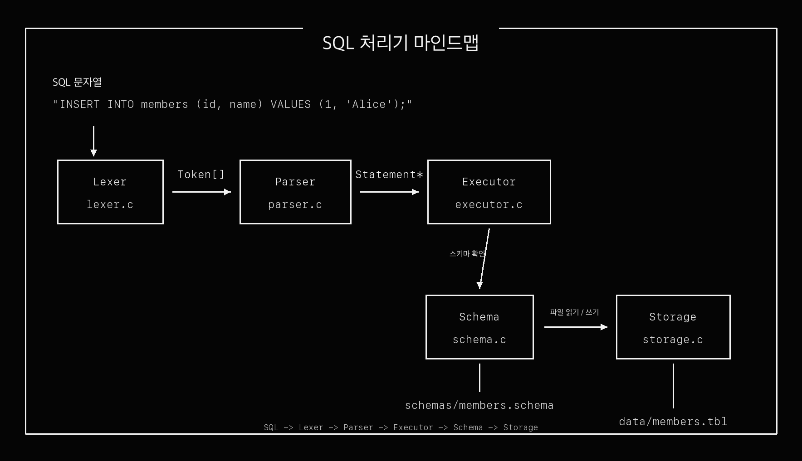
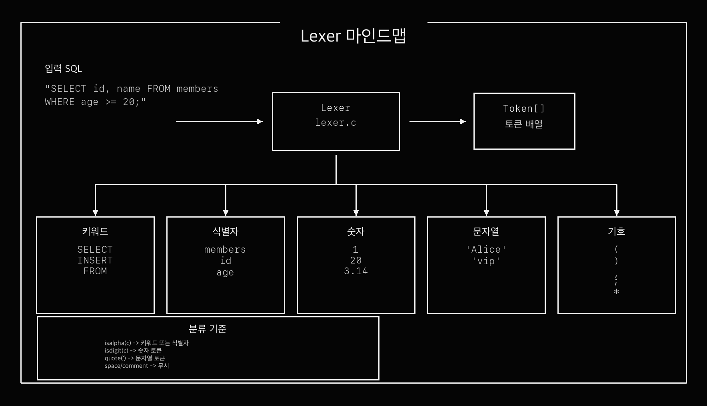
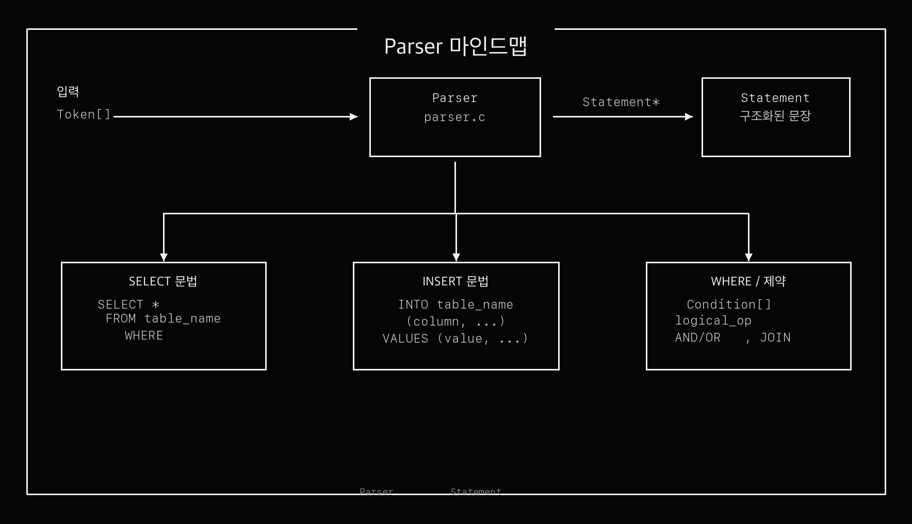
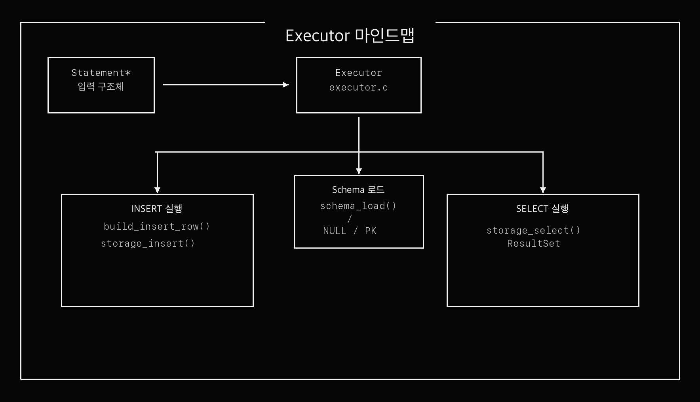
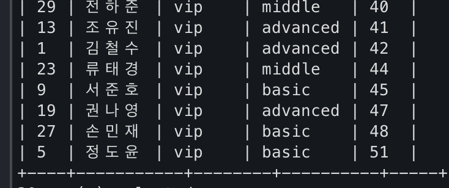
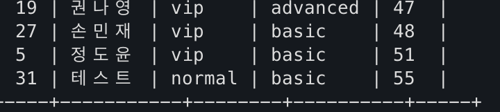

# C SQL Engine

파일 기반 저장소를 사용하는 최소 SQL 처리기입니다.  
C99로 구현했고, `INSERT` 와 `SELECT` 를 지원합니다.

## Overview

이 프로젝트는 아래 흐름으로 동작합니다.

```text
SQL 입력
-> Lexer (토큰 분리)
-> Parser (문장 구조 해석)
-> Executor (실행)
-> Storage (파일 저장 / 파일 조회)
```

데이터는 `data/*.tbl` 파일에 저장되고, 스키마는 `schemas/*.schema` 파일에서 읽습니다.

아래 마인드맵으로 전체/세부 흐름을 바로 확인할 수 있습니다.

### SQL 처리기 전체 파이프라인



### Lexer



### Parser



### Executor



## Supported SQL

현재 지원 범위는 아래와 같습니다.

```sql
INSERT INTO members (id, name, grade, class, age) VALUES (1, 'Alice', 'vip', 'advanced', 30);

SELECT * FROM members;
SELECT id, name FROM members;
SELECT * FROM members WHERE age >= 20;
SELECT * FROM members WHERE grade = 'vip' AND age >= 25;
SELECT * FROM members WHERE class = 'advanced' OR class = 'basic';
SELECT * FROM members ORDER BY age;
SELECT name FROM members ORDER BY age DESC;
```

지원 연산자:

```text
=   !=   <>   <   >   <=   >=
```

주의:

- `CREATE TABLE`, `UPDATE`, `DELETE` 는 구현하지 않았습니다.
- `WHERE` 절에서 `AND` 와 `OR` 를 한 문장 안에 섞는 것은 지원하지 않습니다.
- `ORDER BY` 는 단일 컬럼만 지원합니다.
- `NULL` 은 `INSERT` 값으로만 지원합니다.

## Project Structure

```text
src/
  main.c        CLI 진입점
  types.h       공통 타입
  lexer.c/h     SQL -> Token
  parser.c/h    Token -> Statement
  schema.c/h    schema 파일 로드
  storage.c/h   .tbl 파일 저장 / 조회
  executor.c/h  INSERT / SELECT 실행
  config.c/h    data, schema 경로 설정

schemas/
  members.schema

sql/
  members_demo.sql

data/
  실행 시 .tbl 파일 생성

tests/
  test_*.c
```

## Build

```bash
cd /Users/kunwoopark/WS/jungle-12/week6-c-sql-engine
make
```

디버그 빌드:

```bash
make debug
```

테스트 실행:

```bash
make test
```

정리:

```bash
make clean
```

## Basic Usage

### 1. 데이터 초기화

기존 저장 데이터를 지우고 처음부터 다시 테스트하고 싶을 때:

```bash
rm -f data/members.tbl
```

이 명령은 `members` 의 데이터 파일만 삭제합니다.  
스키마 파일은 그대로 남아 있으므로 `make` 를 다시 할 필요는 없습니다.

### 2. SQL 한 줄 직접 실행

한 명 추가:

```bash
./sqlengine -e "INSERT INTO members (id, name, grade, class, age) VALUES (1, '김철수', 'vip', 'advanced', 42);"
```

전체 조회:

```bash
./sqlengine -e "SELECT * FROM members;"
```

조건 조회:

```bash
./sqlengine -e "SELECT * FROM members WHERE grade = 'vip';"
./sqlengine -e "SELECT * FROM members WHERE age >= 30;"
./sqlengine -e "SELECT id, name FROM members WHERE class = 'advanced';"
./sqlengine -e "SELECT * FROM members ORDER BY age;"
./sqlengine -e "SELECT name FROM members ORDER BY age DESC;"
```

### 3. SQL 파일 실행

예시 SQL 파일 실행:

```bash
./sqlengine -f sql/members_demo.sql
```

직접 SQL 파일을 만들어서 실행할 수도 있습니다.

```bash
cat > sql/test.sql <<'EOF'
INSERT INTO members (id, name, grade, class, age) VALUES (1, '김철수', 'vip', 'advanced', 42);
INSERT INTO members (id, name, grade, class, age) VALUES (2, '이영희', 'normal', 'middle', 27);
SELECT * FROM members;
EOF

./sqlengine -f sql/test.sql
```

`cat > sql/test.sql <<'EOF'` 는 SQL 실행 명령이 아니라,  
여러 줄의 SQL 문장을 `.sql` 파일로 저장하는 셸 문법입니다.

## CLI Options

```bash
./sqlengine -e "SELECT * FROM members;"
./sqlengine -f sql/members_demo.sql
./sqlengine -d ./data -s ./schemas -f sql/members_demo.sql
./sqlengine --help
./sqlengine --version
```

옵션 설명:

- `-e <sql>`: SQL 문자열 직접 실행
- `-f <file>`: SQL 파일 실행
- `-d <dir>`: 데이터 디렉토리 지정
- `-s <dir>`: 스키마 디렉토리 지정
- `--help`: 도움말 출력
- `--version`: 버전 출력

## MEMBERS Schema

기본 테이블은 `members` 입니다.

| column | type | description |
|---|---|---|
| `id` | `INT` | 회원 번호, PK |
| `name` | `VARCHAR(32)` | 이름 |
| `grade` | `VARCHAR(16)` | 회원 등급 (`vip`, `normal`) |
| `class` | `VARCHAR(16)` | 수강반 (`advanced`, `middle`, `basic`) |
| `age` | `INT` | 나이 |

기본 스키마 파일:

[members.schema](/Users/kunwoopark/WS/jungle-12/week6-c-sql-engine/schemas/members.schema)

## Demo Scenario

발표나 확인용으로 가장 간단한 흐름입니다.

```bash
rm -f data/members.tbl
./sqlengine -e "INSERT INTO members (id, name, grade, class, age) VALUES (1, '김철수', 'vip', 'advanced', 42);"
./sqlengine -e "INSERT INTO members (id, name, grade, class, age) VALUES (2, '이영희', 'normal', 'middle', 27);"
./sqlengine -e "SELECT * FROM members;"
./sqlengine -e "SELECT id, name FROM members WHERE age >= 30;"
./sqlengine -e "SELECT * FROM members WHERE grade = 'vip';"
./sqlengine -e "SELECT name FROM members ORDER BY age DESC;"
```

## Error Scenarios

중복 PK:

```bash
./sqlengine -e "INSERT INTO members (id, name, grade, class, age) VALUES (1, '중복회원', 'vip', 'basic', 20);"
```

길이 초과:

```bash
./sqlengine -e "INSERT INTO members (id, name, grade, class, age) VALUES (10, '이름이아주아주아주아주아주길다', 'vip', 'advanced', 30);"
```

없는 컬럼 조회:

```bash
./sqlengine -e "SELECT unknown_column FROM members;"
```

문법 오류:

```bash
./sqlengine -e "SELEC * FROM members;"
```

## Notes

- 데이터 파일은 실행 시 자동 생성됩니다.
- `rm -f data/members.tbl` 후에는 첫 `INSERT` 때 다시 파일이 생성됩니다.
- 한글 이름도 저장 가능합니다.
- 저장 포맷 단순화를 위해 값 안의 `|`, 개행 문자는 지원하지 않습니다.


## INSERT 음수 파싱 에러

`INSERT` 문 처리 과정에서 정수 리터럴의 `-` 부호가 파싱 중 누락되어, 음수가 양수로 저장되는 문제가 있었습니다.

- 증상: `-55`를 입력해도 `55`로 저장됨
- 원인: 정수 토큰 처리 과정에서 부호(`-`)를 보존하지 못함




음수 값 입력 쿼리:

문제 재현 쿼리:

```sql
INSERT INTO members (id, name, grade, class, age) VALUES (31, '테스트', 'normal', 'basic', -55);
```

'-55'-> '55' (음수 -> 정수):


